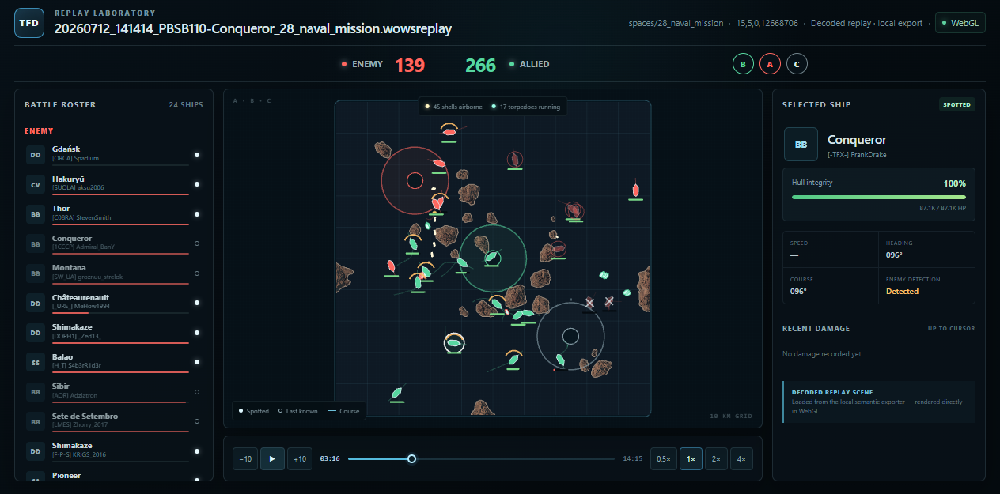

# TFD replay web player experiment

This is a disposable, untracked experiment. It is intentionally isolated from
the production Bridge crates and must not be staged or committed yet.

The experiment tests one architectural idea:

1. Decode a local `.wowsreplay` once in Rust with `wows-toolkit`.
2. Export a renderer-neutral, timestamped **battle scene**.
3. Evaluate that scene at any time in a browser and render the tactical surface
   with PixiJS/WebGL while React/HTML renders controls and information panels.

The battle scene stores facts (position, heading, HP, visibility, shots,
torpedoes, scores, caps, one-shot Arms Race pickups, smoke screens, squadrons,
fighter-patrol wards, consumable activations, and battle chat), not video
frames or screen-space draw commands. That keeps the renderer, layout,
theming, export resolution, and eventual server storage independent from
replay decoding.

## Current layout

- `web/` — interactive player and deterministic synthetic UI harness.
- `exporter/` — experimental native exporter for real replay files.
- `docs/scene-v1.md` — provisional scene contract and known perspective limits.

## Run the web experiment

```powershell
cd web
npm install
npm run dev
```

The development server exposes an experiment-only local replay picker. It scans
the newest 100 files below `C:\Games\World_of_Warships\replays`, or the game
directory supplied through `WOWS_GAME_DIR`, and runs the Rust exporter locally
when a replay is selected. Replay bytes and derived scene data are not uploaded.

## Export a real replay

The exporter deliberately references the local wows-toolkit working copy at
`C:\Users\fhelm\code\wows-toolkit`. It is an experiment, not a portable build
input for TFD Bridge.

```powershell
cd exporter
cargo run --release -- `
  --game "C:\Games\World_of_Warships" `
  --replay "C:\Games\World_of_Warships\replays\15.5.0.0\your-replay.wowsreplay" `
  --output "..\web\public\generated"
```

The exporter writes `scene.json`, `map.png` when available, and only the game
powerup icons referenced by an Arms Race replay. The web player can load the
generated scene from `/generated/scene.json` or accept a scene file through its
import control. Pickup zones now close at the exact `drop.picked` moment: the
picked message carries no zone id (a WG protocol property, not a toolkit gap),
so the exporter matches each pick to the nearest active zone carrying the same
Drop param and also records the pickup attributed to the collecting ship in
`events.pickups`. The Drop record's `startTime` is exported separately:
waiting zones use the inactive game icon and a clockwise activation ring, then
switch to the active icon and a complete border when they become collectible.

The prototype's five ship-class markers are copied from the current game's
`gui/fla/minimap/ship_icons` SVG set. Arms Race marker PNGs likewise come from
`gui/powerups/drops`. They are useful for validating the visual language
locally, but redistribution in a public Bridge/Engine build still needs an
explicit asset-licensing decision.

## What this can and cannot prove

This can prove smooth seeking, interpolation, orientation, visibility states,
HP changes, and projectile rendering from real replay data. A single replay is
not an omniscient server recording: unseen enemy movement and damage may be
absent. Combining matching replays from both teams is a separate follow-up.

## First real-replay result (2026-07-12)

The 15.5 Conqueror replay on Naval Mission exported and played successfully:

- 24 rostered ships and 41,808 sparse pose/state samples.
- 1,665 salvo events (3,532 shells), 330 torpedo tracks, 388 score changes,
  512 capture-point changes, and 18 kills.
- 18.7 MB inspectable pretty JSON; 975 KB with ordinary gzip compression.
- Web build: 429 KB application JavaScript, 129 KB gzip.
- Vitest: 8/8 passing; Rust exporter `cargo check` passing.

## Gap-fill pass (2026-07-12, same replay)

Smoke, squadrons, wards, consumables, chat, and pickup attribution moved from
"known gaps" into the scene (see `docs/scene-v1.md`). The same Conqueror
replay now additionally yields 204 smoke samples, 1,666 squadron position
samples across 115 squadron generations (fighter/bomber/dive/scout over
controllable/consumable/airsupport categories), 100 consumable activations,
and 10 chat messages; wards and pickups are zero in this battle and still
need a confirming replay that contains them. The player renders smoke clouds
and squadron markers on the map, patrol wards as dashed circles, active
consumables as chips on the selected ship, and battle chat as a map overlay
that respects the timeline cursor. Vitest: 9/9 passing.

The UI was also re-themed to the tfd-engine dark theme: Space Grotesk,
violet-navy surfaces, the TFD teal accent for interactive/allied states, and
the engine's destructive red for the enemy team (both sides sourced from
`engine.tfd.rocks` design tokens).

## Visual refinement pass (2026-07-12)

- Squadrons and fighter wards render the **game's tactical-map marker set**
  (`gui/battle_hud/markers/plane` + `ward_fighters/ward.png`, own/ally/enemy
  variants) — bundled as static assets under `web/public/assets/plane-markers/`
  since the icon set is constant per game version. They are drawn **upright**
  (the markers are type glyphs — rocket-fighter crosshair, bomb, torpedo bars,
  spotter sonar, smoke — not directional silhouettes) at a small size.
  (The exporter's earlier per-battle `load_plane_icons` extraction pulled the
  smaller *minimap* set; the player now prefers the bundled tactical set. A
  future bridge integration should extract the tactical set from the local
  game VFS rather than bundle it.)
- Shell tracers are fine and long and **colored by ammo type** (HE/AP/SAP);
  torpedoes are a distinct green capsule with a wake so they no longer read
  like shells.
- Capture progress is shown as a **sweeping arc on the cap ring itself** (no
  more linear bars or status text); cap letters are sized down.
- Ship health is a **ring around the marker, hidden at full HP**, so only
  damaged ships carry an indicator.
- Battle chat moved from a map overlay into the **right sidebar**, colored by
  audience (team green, division yellow, all/global white) with no channel
  label.


